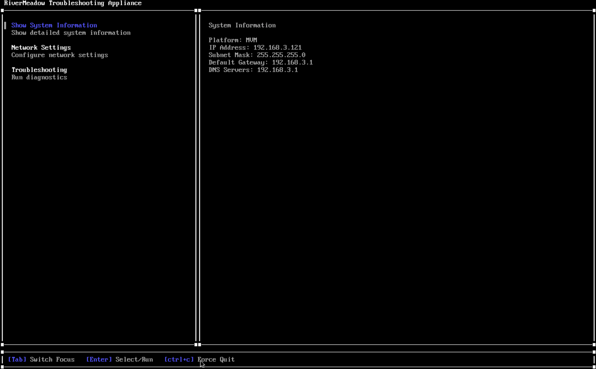
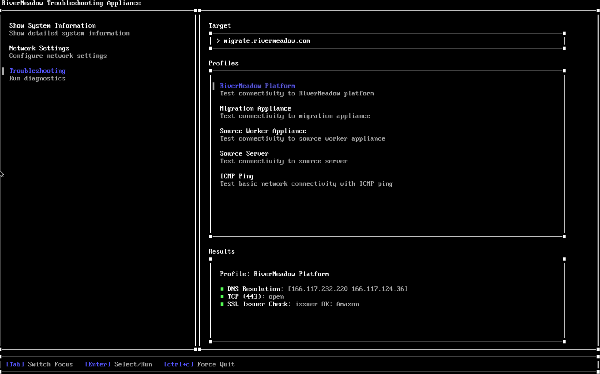

# RiverMeadow Helper VM

The RiverMeadow helper virtual appliance is a troubleshooting tool to help perform environment validation and identify network connectivity issues.

## Getting Started

To quickly get started with the helper virtual appliance you'll need to download the latest ISO release from [https://github.com/rivermeadow-software/rms-helper-vm/releases](https://github.com/rivermeadow-software/rms-helper-vm/releases).

### Supported Target Platforms

The helper appliance virtual machine has been tested on the following platforms but should work on any virtualization platform that supports Alpine Linux.

* HPE Morpheus VM Essentials
* Microsoft Hyper-V
* Nutanix AHV

### Appliance Minimum Requirements

A new virtual machine on the target platform should be created from the ISO.

* CPU: 1
* RAM: 512 MB
* Hard Disk Space: No hard drive required

### IP Address Configuration

The virtual appliance will attempt to acquire an IP address using DHCP by default. A static IP address can be configured from the **Network Settings** section of the TUI. 

## Profiles
The helper virtual appliance includes several testing profiles for performing a suite or collection of tests that are used to validate common issues with the RiverMeadow solution.

| Name | Description | Checks  |
|------|-------------|---------|
| RiverMeadow Platform | Test the connectivity to the RiverMeadow workload mobility platform. This profile is used to mimic the RiverMeadow migration appliance connecting to the RiverMeadow hosted platform. | DNS Resolution, Port Test (443), SSL Interception |
| Migration Appliance | Test the connectivity to the RiverMeadow migration appliance deployed to the target environment. This profile is used to mimic the RiverMeadow target worker deployed to the target environment. | Port Test (10000, 8080, 443, 8888) |
| Source Worker Appliance | Test the connectivity to the RiverMeadow source worker appliance deployed to the source VMware vSphere environment for VM based migrations. This profile is used to mimic the RiverMeadow target worker deployed to the target environment. | Port Test (5994) |
| Source Server | Test the connectivity to the source server for OS based migrations. This profile is used to mimic the RiverMeadow target worker deployed to the target environment.  | Port Test (5994) |
| ICMP Ping | A generic ICMP Ping for performing basic connectivity to servers in the environment. | ICMP Ping to Target |

## Troubleshooting Checks

The helper virtual appliance has been loaded with tools to help with troubleshooting network connectivity between the components of the RiverMeadow solution. The following checks are utilized by the predefined test profiles.

| Name | Description |
|------|-------------|
| DNS Check | The helper appliance attempts to resolve a hostname using the configured DNS servers(s) |
| DHCP Check | The helper virtual appliance initiates a DHCP request to validate if there is a DHCP server available on the network that responds to requests |
| Network ICMP Ping | A generic ICMP request that enables basic network connectivity testing for other systems on the network such as gateways or servers|
| Network Connection Test | The helper appliance initiates a TCP connection to the designated target on the designated port |
| SSL Interception Check | The helper appliance initiates a connection to the RiverMeadow platform and evaluates if the response indicates that SSL interception is being performed |

## Security Configuration
The helper virtual appliance has been hardened to align with the limited use case to ensure that it is lightweight and it aligns with security best practices.

### Security Hardening

The following security hardening is applied to the helper virtual appliance to align with security best practices:

| Name | Description |
|------|-------------|
| No SSH packages | There are no SSH packages installed on the virtual appliance |
| All ingress network traffic dropped by default | All ingress network traffic to the virtual appliance is denied by the host firewall |
| Egresss network traffic restricted | Only the designated egress network ports and protocols are allowed by the host firewall |
| All unnecessary packages are removed | The virtual appliance contains a limited number for system packages and are only those that are required |
| Limited services are running | The helper virtual appliance runs only the required services |
| Ephemeral deployment | The helper virtual appliance is stateless and utilizes an ephemeral operating model |
| Restricted program access | The helper virtual appliance only runs the troubleshooting utility and only allows access to the troubleshooting utility |

### Egress Network Ports and Protocols

The following network ports and protocols are allowed for egress network traffic from the helper virtual appliance:

| Name | Description | Intended Destination | Port | Protocol |
|------|:-------------:|------|:------:|:----------:|
| Source Data Transfer | Used to verify the TCP port used by the RiverMeadow source worker appliance and migration utility is accessible from the target worker or migration appliance  | Source Server, Source Worker Appliance | 5994 | TCP |
| API Access | Used to verify the TCP port used by the RiverMeadow migration appliance and hosted platform | Migration Appliance, RiverMeadow Platform | 443 | TCP |
| Logs | Used to verify the TCP port used by the RiverMeadow migration appliance | Migration Appliance | 8080 | TCP |
| Message Bus | Used to verify the TCP port used by the RiverMeadow migration appliance | Migration Appliance | 8888 | TCP |

### Ingress Network Port and Protocols

The following network ports and protocols are allowed for ingress network traffic traffic to the source helper virtual appliance:

| Name | Description | Destination | Port | Protocol |
|------|-------------|------|:------:|:----------:|
| N/A  | No ingress network ports are allowed | N/A | N/A | N/A |

### Software Bill of Materials
A software bill of materials is generated with every build that includes the following details:

| Name | Description |
|------|--------------|
| Golang Binary | The libraries that are used to be build the Golang binary. |
| Apline Operating System | The helper virtual appliance is built on Alpine Linux and the installed packages and their versions. |

### Patch Management

The virtual appliance is ephemeral and stateless by design for improved security. Updates to the troubleshooting utility and system packages are managed by downloading the latest version of the of the virtual appliance ISO file.
